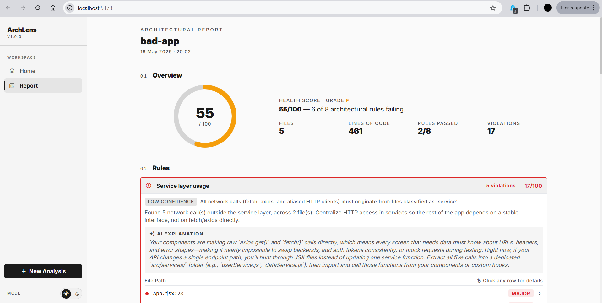

# ArchLens

A two-mode toolkit that turns *"is this React Native codebase well-architected?"* from a subjective opinion into a measurable score.

| Mode | What it does | When it runs |
|---|---|---|
| **archlens-statik** | Parses RN source code and scores it against 8 architectural rules — service layer usage, layer separation, Rules of Hooks, naming conventions, inline styles, native APIs in UI, file complexity, circular dependencies. | On the developer's machine, against source files. |
| **archlens-runtime** | A small library installed inside an RN app. A reviewer taps a floating button, taps any UI element, leaves a note. The tool captures a screenshot, the screen, and the source file/line. After fixes are applied, a CLI uses Claude vision to verify whether each issue is resolved. | On a real device or simulator, then on the developer's laptop. |

The two modes are complementary: static analysis catches structural issues in code, runtime UX audit catches issues in how the code feels when used.

---

## Demo video

📺 [Watch the demo on YouTube](https://youtu.be/PLACEHOLDER) — walkthrough of the static analyzer mode (`archlens-statik`).

> Replace the link above with your real YouTube URL once uploaded.
> The runtime UX audit mode is documented in the screenshots below and can be demoed live by running `npx expo start` inside `packages/runtime-demo`.

---

## Screenshots

### Static analyzer — report page



The web UI after analyzing a project. Shows the overall score, per-rule pass/fail breakdown, and AI-generated explanations for failed rules.

### Static analyzer — violation detail panel


Clicking a violation row opens a side panel with the rule description and an AI-generated fix suggestion specific to that file and line.

> Drop your real screenshots into `docs/screenshots/` and rename to match the paths above. (Runtime UX audit screenshots will be added once that module is finalized.)

---

## Quick start

```bash
git clone https://github.com/seyyah/arch-lens.git
cd arch-lens
npm install
```

### Run the static analyzer

```bash
npm run statik:backend:dev     # Express API on http://localhost:8000
npm run statik:frontend:dev    # Vite UI on http://localhost:5173
```

Open the UI, upload a `.zip` of an RN project (or paste a public GitHub URL), see the architectural report.

### Run the demo UX audit on your phone

```bash
cd packages/runtime-demo
npx expo start
```

Scan the QR code with Expo Go. A floating ArchLens button appears in dev mode → tap it → tap any element → leave a note → export.

### Run the verify loop (after the developer fixes the code)

```bash
npx archlens-verify \
  --report path/to/ux-audit.md \
  --after  path/to/after-screenshots/
```

Claude vision compares the before / after screenshots and writes verdicts back into the report (`verified` / `rejected` / `uncertain`).

The CLI also has a `--dry-run` mode so you can test the full pipeline without an API key.

---

## Repository layout

```
packages/
├── ai-client/             @archlens/ai-client     (shared) Claude SDK wrapper used by both modes
│
│   ── archlens-statik (static code analyzer) ──
├── statik-backend/        Node + TypeScript       AST analyzer + Express API
├── statik-frontend/       Vite + React            report UI
│
│   ── archlens-runtime (live UX audit) ──
├── runtime-lib/           @archlens/runtime       in-app RN library
├── runtime-verify/        @archlens/verify        AI verify CLI
└── runtime-demo/          @archlens/runtime-demo  sample Expo app for testing

tests/                     three test React Native projects (good / bad / unusual layout)
demo/                      curated end-to-end demo fixtures
```

It's an npm workspaces monorepo — `npm install` at the root sets up everything.

---

## How it works — short version

1. **Static module** — Babel parses every source file into an AST. A multi-signal classifier labels each file (screen / component / hook / service / etc.) using folder, filename, and code patterns. Eight rules run on the result. Each failed rule gets a Claude-written, project-specific explanation.

2. **Runtime module** — A small React Native library (`<ArchLensProvider>`) is wrapped around the host app. In dev mode it shows a floating button. Tapping a UI element captures a screenshot, walks React's fiber tree to identify the component and its source file/line, and stores the annotation locally. Sessions export as Markdown.

3. **Verify CLI** — Takes the exported Markdown plus after-screenshots and sends each (before, after, reviewer note) triple to Claude vision. Returns strict JSON verdicts and writes them back into the report.

The architectural principle: **AI never decides — it only explains and verifies.** All violations and verdicts are anchored in deterministic rules and source-grounded comparisons.

---

## Configuration

Copy `.env.example` to `.env` at the workspace root and add your Anthropic API key:

```bash
cp .env.example .env
# then edit .env and paste your key into ANTHROPIC_API_KEY=
```

Get a key at [console.anthropic.com](https://console.anthropic.com/). Default model is Claude Sonnet 4.5.

The static analyzer also works fully offline — pass `--ai` only when you want AI-written explanations. The verify CLI has a `--dry-run` mode that requires no key.

---

## Tests

The `tests/` folder contains three React Native projects designed to exercise the analyzer:

| Project | What it tests |
|---|---|
| **good-app** | Clean architecture — analyzer should score it near 100 |
| **bad-app** | Intentional violations across most rules — analyzer should score it low and flag specific issues |
| **unusual-layout-app** | Non-standard folder structure — tests the multi-signal classifier's ability to assign correct layers without canonical folder names |

Run the analyzer against any of them:

```bash
node packages/statik-backend/dist/cli.js ./tests/good-app
node packages/statik-backend/dist/cli.js ./tests/bad-app --ai
node packages/statik-backend/dist/cli.js ./tests/unusual-layout-app
```

Backend unit tests for the rules:

```bash
npm run test:statik
```

---

## License

MIT
