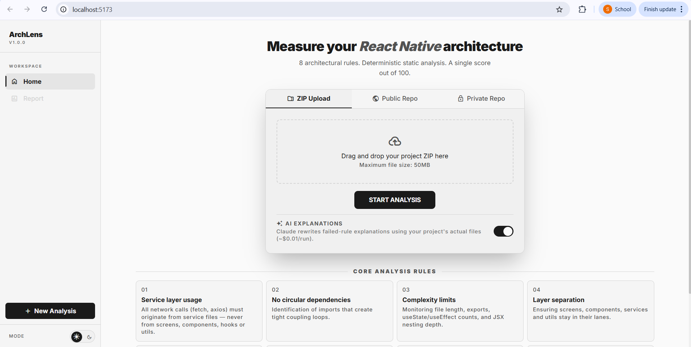
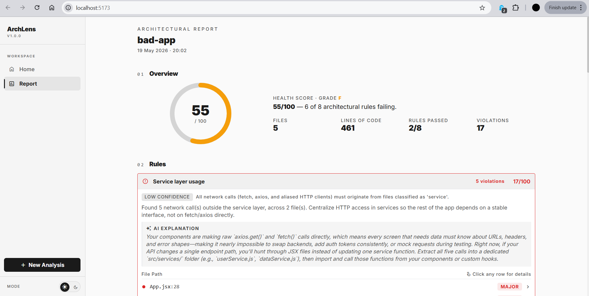

# ArchLens

A two-mode toolkit that turns *"is this React Native codebase well-architected and well-designed?"* from a subjective opinion into a measurable score with concrete, actionable issues.

| Mode | What it does | Where it runs |
|---|---|---|
| **archlens-statik** | Parses RN source code and scores it against 8 architectural rules — service layer usage, layer separation, Rules of Hooks, naming conventions, inline styles, native APIs in UI, file complexity, circular dependencies. | Developer's machine, against source files. |
| **archlens-runtime** | A small library installed inside an RN app. A reviewer taps a floating button, taps any UI element, leaves a categorized note. The annotation (with screenshot, screen, component metadata) is sent to a cloud backend and shows up on a web dashboard where the developer triages it. | Reviewer's device or simulator → cloud → developer's browser. |

The two modes are complementary: static analysis catches structural problems in code; the runtime UX audit catches problems in how the code feels when used.

---

## Demo videos

📺 **Static analyzer (`archlens-statik`)** — walkthrough of the upload-or-paste-URL flow, the 8 rules, scoring, and AI-written explanations:
[Watch on YouTube](https://www.youtube.com/watch?v=Y1ywwYOczZU)

📺 **Runtime UX audit (`archlens-runtime`)** — walkthrough of capturing an annotation on a phone, the cloud sync, and the triage flow on the dashboard:
[Watch on YouTube](https://youtu.be/6nCJsojgvPk)

---

## Screenshots — static analyzer

### Home page



The landing page. Users upload a `.zip` of a React Native project or paste a GitHub URL to start the analysis.

### Report page



The output of an analysis. Shows the overall score, the 8 architectural rules with pass/fail status, and AI-generated explanations for each failed rule.

---

## Quick start

```bash
git clone https://github.com/sidimdb/ArchLens.git
cd ArchLens
npm install
```

### Run the static analyzer

```bash
npm run statik:backend:dev     # Express API on http://localhost:8000
npm run statik:frontend:dev    # Vite UI   on http://localhost:5173
```

Open the UI, upload a `.zip` of an RN project (or paste a public/private GitHub URL), see the architectural report and AI-written explanations for failed rules.

### Run the runtime UX audit end-to-end

The runtime mode has three moving parts: the in-app library inside the host app, the cloud API that receives annotations, and the dashboard where developers triage them.

**1. Start the cloud API** (Fastify, talks to Supabase):
```bash
npm run cloud:dev              # http://localhost:8787
```

**2. Start the dashboard** (Vite + React):
```bash
npm run dashboard:dev          # http://localhost:5174
```

**3. Run the demo app on a phone** (Expo Go or simulator):
```bash
cd packages/runtime-demo
npx expo start
```
Scan the QR with Expo Go. A floating ArchLens button appears → tap it → tap any UI element → write a note + pick a category → save. The annotation shows up in the dashboard within seconds.

---

## Repository layout

```
packages/
├── ai-client/             @archlens/ai-client      (shared) Claude SDK wrapper used by both modes
│
│   ── archlens-statik (static code analyzer) ──
├── statik-backend/        Node + TypeScript        AST analyzer + Express API
├── statik-frontend/       Vite + React             upload UI + report viewer
│
│   ── archlens-runtime (live UX audit) ──
├── runtime-lib/           @archlens/runtime        in-app RN library (floating button + capture)
├── runtime-demo/          @archlens/runtime-demo   sample Expo app for testing the library
├── cloud-api/             @archlens/cloud-api      Fastify backend → Supabase (screenshots + issues)
└── dashboard-web/         @archlens/dashboard-web  Vite + React triage dashboard for developers

tests/                     three RN test projects (good / bad / unusual layout)
demo/                      curated end-to-end demo fixtures
supabase/                  Supabase project config + migrations
```

It's an npm workspaces monorepo — `npm install` at the root sets up everything.

---

## How it works — short version

1. **Static module** — Babel parses every source file into an AST. A multi-signal classifier labels each file (screen / component / hook / service / etc.) using folder, filename, and code patterns. Eight rules run on the result. Each failed rule gets a Claude-written, project-specific explanation that the developer can act on.

2. **Runtime module** — A small React Native library (`<ArchLensProvider>`) is wrapped around the host app. In dev mode it shows a floating button. When a reviewer taps a UI element, the library captures a screenshot, walks React's fiber tree to identify the component (name + source file + line) and the screen, and posts the annotation along with the reviewer's note and category to the cloud API. The cloud API stores the screenshot in Supabase Storage and the issue metadata in Postgres. The dashboard reads from the same Postgres and lets developers filter, change status, and drill into the source location.

The architectural principle: **AI never decides — it only explains.** All architectural violations and all UX issues are anchored in deterministic rules or human reviewer input.

---

## Configuration

Copy `.env.example` to `.env` at the workspace root and add your keys:

```bash
cp .env.example .env
# then edit .env and paste:
#   ANTHROPIC_API_KEY=...        (for statik AI-explanations)
#   SUPABASE_URL=...             (for runtime cloud sync)
#   SUPABASE_SERVICE_ROLE_KEY=...
```

Get an Anthropic key at [console.anthropic.com](https://console.anthropic.com/). Default model is Claude Sonnet 4.5.

The static analyzer also works fully offline — pass `--ai` only when you want AI-written explanations.

---

## Tests

The `tests/` folder contains three React Native projects designed to exercise the static analyzer:

| Project | What it tests | Expected score |
|---|---|---|
| **good-app** | Clean architecture, all rules satisfied | ~95 / A |
| **bad-app** | Intentional violations across most rules | ~55 / F |
| **unusual-layout-app** | Non-standard folder structure — tests the multi-signal classifier's ability to assign correct layers without canonical folder names | ~78 / C |

Run the analyzer against any of them:

```bash
node packages/statik-backend/dist/cli.js ./tests/good-app
node packages/statik-backend/dist/cli.js ./tests/bad-app --ai
node packages/statik-backend/dist/cli.js ./tests/unusual-layout-app
```

Backend unit tests for the rules:

```bash
npm run test:statik
```

Each test project was hand-graded against a ground truth before being run through ArchLens; results match the ground truth.

---

## License

MIT
